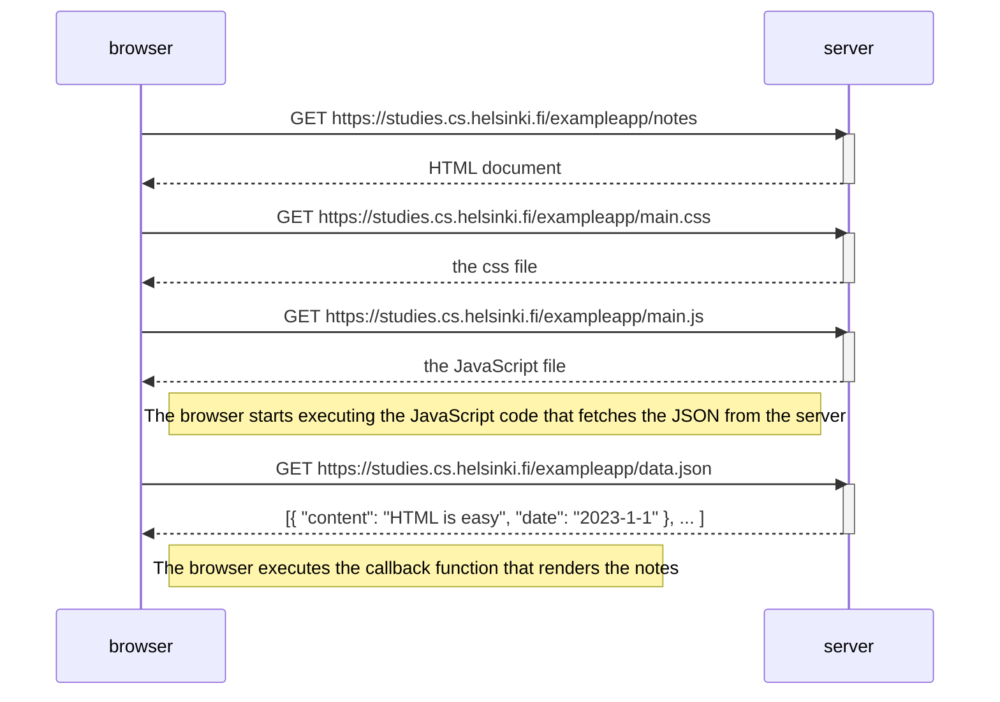

### 0.4: Nuevo diagrama de notas
En la sección Carga de una página que contiene JavaScript - revisión , la cadena de eventos causados ​​al abrir la página https://studies.cs.helsinki.fi/exampleapp/notes se representa como un diagrama de secuencia

El diagrama se creó como un archivo GitHub Markdown utilizando la sintaxis Mermaid , de la siguiente manera:

#### Cree un diagrama similar
que represente la situación en la que el usuario crea una nueva nota en la página https://studies.cs.helsinki.fi/exampleapp/notes escribiendo algo en el campo de texto y haciendo clic en el botón Guardar .