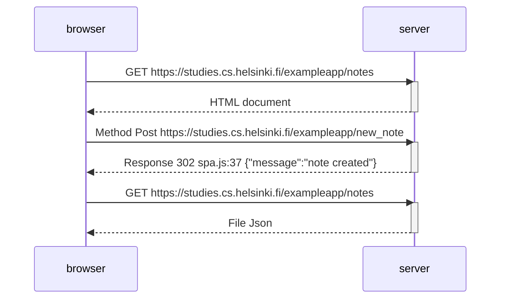
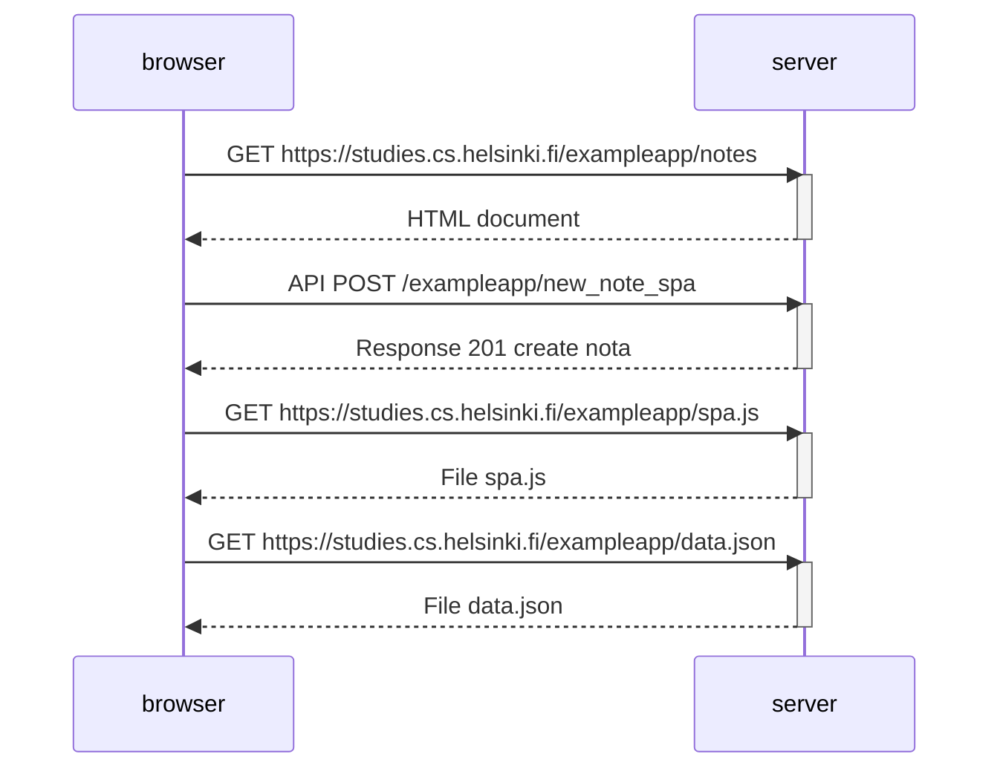
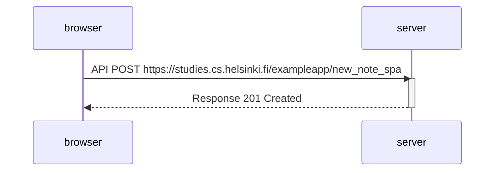

### 0.4: Nuevo diagrama de notas
En la sección Carga de una página que contiene JavaScript - revisión , la cadena de eventos causados ​​al abrir la página https://studies.cs.helsinki.fi/exampleapp/notes se representa como un diagrama de secuencia

El diagrama se creó como un archivo GitHub Markdown utilizando la sintaxis Mermaid , de la siguiente manera:

#### Cree un diagrama similar
que represente la situación en la que el usuario crea una nueva nota en la página https://studies.cs.helsinki.fi/exampleapp/notes escribiendo algo en el campo de texto y haciendo clic en el botón Guardar .

### Respuesta

### 0.5: Single page app diagram
Create a diagram depicting the situation where the user goes to the single-page app version of the notes app at https://studies.cs.helsinki.fi/exampleapp/spa.

### Respuesta

### 0.6: New note in Single page app diagram
Create a diagram depicting the situation where the user creates a new note using the single-page version of the app.

This was the last exercise, and it's time to push your answers to GitHub and mark the exercises as done in the submission system.

